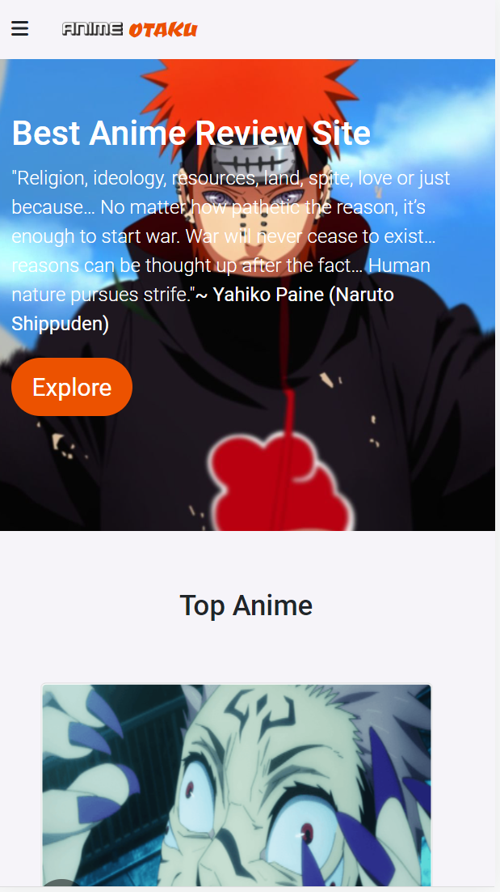
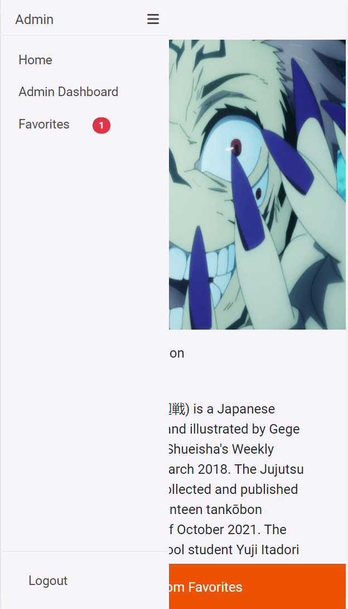
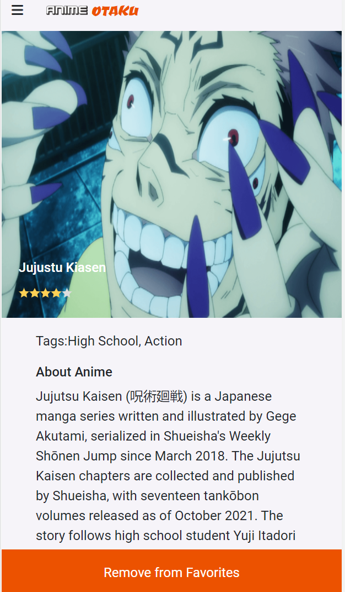
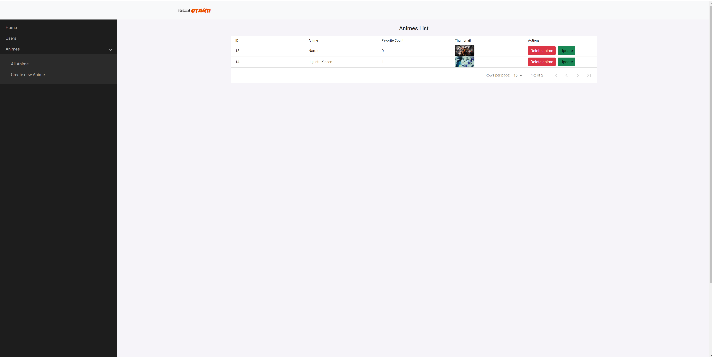

# ANIME OTAKU

## Overview

>The **ANIME OTAKU** is a anime review web app that displays a list of animes for anime enthusiasts to view. User can choose to save their favorite animes and come back view them later.
>The data is served from the API built using Ruby on Rails framework.
>
<div align="center">

[](https://github.com/Ceejayski/anime-otaku-client)
[](https://github.com/Ceejayski/anime-otaku-client/issues)
[](https://github.com/Ceejayski/anime-otaku-client/pulls)

</div>

## 📝 Table of Contents

<p align="center">
<a href="#with">Built with</a>&nbsp;&nbsp;&nbsp;|&nbsp;&nbsp;&nbsp;
<a href="#live-demo">Live Demo Link</a>&nbsp;&nbsp;&nbsp;|&nbsp;&nbsp;&nbsp;
<a href="#available-scripts">Available Scripts</a>&nbsp;&nbsp;&nbsp;|&nbsp;&nbsp;&nbsp;
<a href="#gs">Getting started</a>&nbsp;&nbsp;&nbsp;|&nbsp;&nbsp;&nbsp;
<a href="#author">Author</a>
</p>

## 🔧 Built with<a name = "with"></a>
- ReactJS
- React-Redux
- HTML 5 and CSS 3

## Screenshots
<div float = 'left'>
 
</div>
<div float='left'>

</div>
<div float='left'>


</div>
## Live Demo Link <a name = "live-demo"></a>

## See Live
See live on [Netlify](https://silly-golick-1cef53.netlify.app)


## Available Scripts <a name= "available-scripts"></a>

In the project directory, you can run:

### `npm start`

Runs the app in the development mode.\
Open [http://localhost:3000](http://localhost:3000) to view it in the browser.

The page will reload if you make edits.\
You will also see any lint errors in the console.

### `npm test`

Launches the test runner in the interactive watch mode.\
See the section about [running tests](https://facebook.github.io/create-react-app/docs/running-tests) for more information.

### `npm run build`

Builds the app for production to the `build` folder.\
It correctly bundles React in production mode and optimizes the build for the best performance.

The build is minified and the filenames include the hashes.\
Your app is ready to be deployed!

See the section about [deployment](https://facebook.github.io/create-react-app/docs/deployment) for more information.

## Getting Started <a name = "gs"></a>
This project was bootstrapped with [Create React App](https://github.com/facebook/create-react-app).

Make sure you have [Node](https://nodejs.org/en/), installed in your computer.

To get a local copy of the repository please run the following commands on your terminal:

```
$ git clone https://github.com/Ceejayski/anime-otaku-client
```
```
$ cd anime-otaku-client
```

```
$ npm install
```
```
$ npm start
```

This runs the app in the development mode.
Open [http://localhost:3000](http://localhost:3000) to view it in the browser.

## Testing
This app has been tested using the ```react-testing-library```.
Run ```npm test``` in the console to run the tests.

## ✒️  Authors <a name = "author"></a>

### Author(s)


👤 **Okoli Chijioke**

- Github: [@ceejayski](https://github.com/ceejayski)

- LinkedIn: [LinkedIn](https://www.linkedin.com/in/okoli-ceejay/)
- 
## Show your support

Kindly ⭐ Star this project on GitHub — it helps!

## Acknowledgments

- My thanks goes to Microverse and all our peers and colleagues there.

## 🤝 Contributing

Contributions, issues and feature requests are welcome!

Feel free to check the [issues page](https://github.com/Ceejayski/anime-otaku-client/issues).


## 👍 Show your support

Give a ⭐️ if you like this project!

## :clap: Acknowledgements
- [Microverse](https://www.microverse.org/)

## 📝 License

This project is [MIT](./LICENSE) licensed.